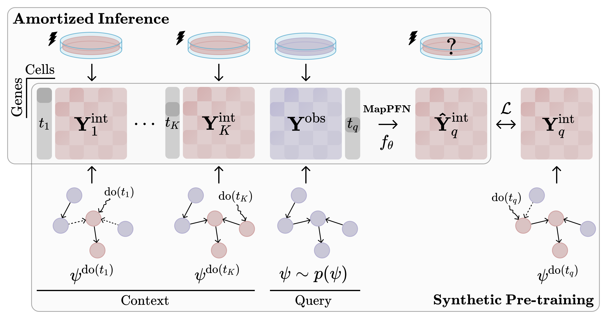

# MapPFN: Learning Causal Perturbation Maps in Context

This repository contains the code, configurations, and data processing scripts to reproduce the experiments for **MapPFN**, a prior-data fitted network (PFN) that uses in-context learning to predict perturbation effects in unseen biological contexts.



## Abstract

Planning effective interventions in biological systems requires treatment-effect models that adapt to unseen biological contexts by identifying their specific underlying mechanisms. Yet single-cell perturbation datasets span only a handful of biological contexts, and existing methods cannot leverage new interventional evidence at inference time to adapt beyond their training data. To meta-learn a perturbation effect estimator, we present MapPFN, a prior-data fitted network (PFN) pretrained on synthetic data generated from a prior over causal perturbations. Given a set of experiments, MapPFN uses in-context learning to predict post-perturbation distributions, without gradient-based optimization. Despite being pretrained on *in silico* gene knockouts alone, MapPFN identifies differentially expressed genes, matching the performance of models trained on real single-cell data.

## Table of Contents

- [Setup](#setup)
- [Repository Structure](#repository-structure)
- [Usage](#usage)
  - [Data Generation](#data-generation)
  - [Training](#training)
- [Dependencies](#dependencies)

## Setup

A `Dockerfile` is provided for containerized environments. The image includes all dependencies and can be used with Docker or Apptainer on HPC clusters.

Logging to WandB is optional for local jobs but mandatory for jobs submitted to the cluster. Create a `.env` file in the root of the repository with:

```bash
WANDB_API_KEY=your_api_key
WANDB_ENTITY=your_entity
WANDB_PROJECT=your_project_name
```

## Repository Structure

```
MapPFN/
├── map_pfn/
│   ├── configs/         # Hydra-zen configuration files
│   ├── data/            # Dataset classes and data generation
│   │   ├── linear_scm.py        # Linear SCM data generation
│   │   ├── sergio_dataset.py    # SERGIO GRN simulation
│   │   └── perturbation_dataset.py
│   ├── models/          # Model architectures
│   │   ├── map_pfn.py           # MapPFN model
│   │   └── mmdit.py             # MMDiT architecture
│   ├── eval/            # Evaluation metrics
│   ├── loss/            # Loss functions (CFM)
│   ├── scripts/         # Training and data generation scripts
│   │   ├── train.py
│   │   └── generate_data.py
│   ├── train/           # Training utilities
│   └── utils/           # Helper functions
├── baselines/
│   ├── condot/          # Conditional Optimal Transport baseline
│   └── metafm/          # Meta Flow Matching baseline
└── datasets/            # Generated datasets (gitignored)
```

## Usage

### Data Generation

Generate synthetic datasets from linear SCMs or biological priors:

```bash
# Generate linear SCM data
python map_pfn/scripts/generate_data.py cfg=linear_scm

# Generate SERGIO GRN data
python map_pfn/scripts/generate_data.py cfg=sergio_grn
```

### Training

Train MapPFN or baselines using the provided configurations:

```bash
# Train MapPFN on linear SCMs
python map_pfn/scripts/train.py cfg=map_pfn_scm
````

Available model configs: `map_pfn_scm`, `map_pfn_rna`, `condot_scm`, `condot_rna`, `metafm_scm`, `metafm_rna`

```bash
# Run distributed sweep on Slurm
python map_pfn/scripts/train.py cfg/job=methods_scm
```

Available sweep configs: `methods_scm`, `methods_sergio`, `map_pfn_scm`, `map_pfn_sergio`

See [map_pfn/configs/train/config_stores.py](map_pfn/configs/train/config_stores.py) for all available configurations. This project uses [hydra-zen](https://github.com/mit-ll-responsible-ai/hydra-zen) for configuration management. Override parameters via command line:

```bash
python map_pfn/scripts/train.py cfg=map_pfn_scm cfg.datamodule.batch_size=64
```

## Dependencies

This project builds on the following open-source libraries:

- [JAX](https://github.com/google/jax) - High-performance numerical computing
- [Equinox](https://github.com/patrick-kidger/equinox) - Neural networks in JAX
- [Hydra-zen](https://github.com/mit-ll-responsible-ai/hydra-zen) - Configuration management
- [Diffrax](https://github.com/patrick-kidger/diffrax) - Differential equation solvers in JAX
- [OTT-JAX](https://github.com/ott-jax/ott) - Optimal transport tools
- [AnnData](https://github.com/scverse/anndata) - Annotated data for single-cell analysis
- [Scanpy](https://github.com/scverse/scanpy) - Single-cell analysis in Python
- [Pertpy](https://github.com/theislab/pertpy) - Perturbation analysis tools
- [sergio_rs](https://github.com/rainx0r/sergio_rs) - Single-cell expression simulator
- [grn-paper](https://github.com/maguirre1/grn-paper) - Gene regulatory network sampling
