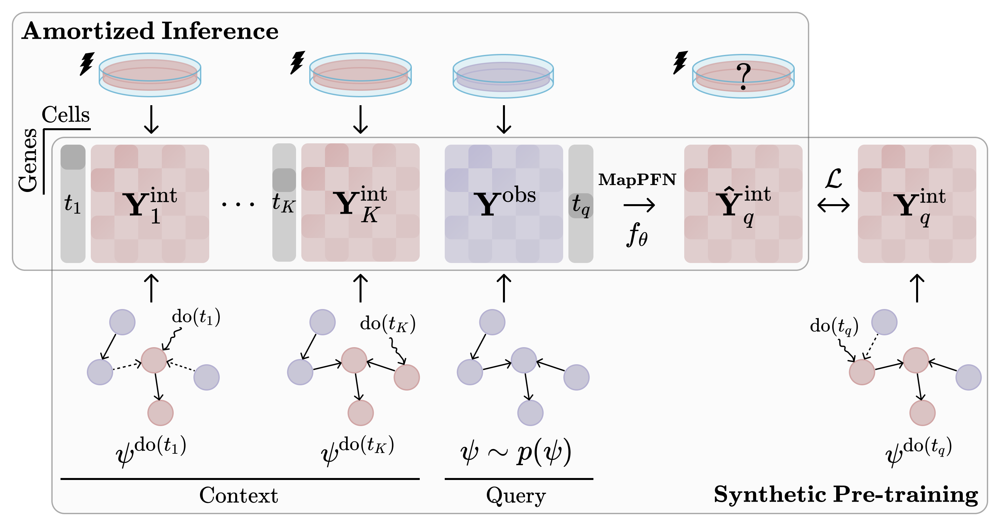

<h1 align="center">MapPFN: Learning Causal Perturbation Maps in Context</h1>

<p align="center">
  <a href="https://arxiv.org/abs/2601.21092"></a>
  <a href="https://marvinsxtr.github.io/MapPFN"></a>
  <a href="https://huggingface.co/marvinsxtr/MapPFN"></a>
  <a href="https://huggingface.co/datasets/marvinsxtr/MapPFN"></a>
</p>

**MapPFN** is a prior-data fitted network (PFN) that uses in-context learning to predict perturbation effects in unseen biological contexts.

<div align="center">
  
  <p><em><strong>MapPFN overview.</strong> During pre-training, synthetic causal models are drawn to generate observational and interventional distributions. MapPFN meta-learns to map between pre- and post-perturbation distributions across many causal structures. At inference, it predicts cell-level post-perturbation distributions in one forward pass through amortized inference.</em></p>
</div>

## Abstract

Planning effective interventions in biological systems requires treatment-effect models that adapt to unseen biological contexts by identifying their specific underlying mechanisms. Yet single-cell perturbation datasets span only a handful of biological contexts, and existing methods cannot leverage new interventional evidence at inference time to adapt beyond their training data. To meta-learn a perturbation effect estimator, we present MapPFN, a prior-data fitted network (PFN) pre-trained on synthetic data generated from a prior over causal perturbations. Given a set of experiments, MapPFN uses in-context learning to predict post-perturbation distributions. Pre-trained on *in silico* gene knockouts alone, MapPFN identifies differentially expressed genes on par with models trained on real single-cell data. Fine-tuned, it consistently outperforms baselines across downstream datasets.

## Setup

A Docker image and devcontainer configuration are provided with all dependencies:

```bash
docker run --rm -it --gpus all -v .:/srv/repo ghcr.io/marvinsxtr/mappfn:latest bash
```

<details>
<summary>VSCode & Slurm</summary>

Use the [Remote - Containers](https://marketplace.visualstudio.com/items?itemName=ms-vscode-remote.remote-containers) extension to open the devcontainer locally, or connect to a remote tunnel by replacing `bash` with `code tunnel`.

This setup also works with Apptainer on Slurm clusters. See the [ml-project-template](https://github.com/marvinsxtr/ml-project-template) for instructions.

</details>

<details>
<summary>WandB logging (optional)</summary>

Create a `.env` file in the repository root:

```bash
WANDB_API_KEY=your_api_key
WANDB_ENTITY=your_entity
WANDB_PROJECT=your_project_name
```

</details>

## Data

Download pre-trained [weights](https://huggingface.co/marvinsxtr/MapPFN) and [datasets](https://huggingface.co/datasets/marvinsxtr/MapPFN) from Hugging Face:

```python
from huggingface_hub import hf_hub_download

hf_hub_download("marvinsxtr/MapPFN", "model.ckpt", local_dir="checkpoints", repo_type="model")
hf_hub_download("marvinsxtr/MapPFN", "frangieh.h5ad", local_dir="datasets/single_cell", repo_type="dataset")
hf_hub_download("marvinsxtr/MapPFN", "papalexi.h5ad", local_dir="datasets/single_cell", repo_type="dataset")
hf_hub_download("marvinsxtr/MapPFN", "sergio.h5ad", local_dir="datasets/synthetic", repo_type="dataset")
```

<details>
<summary>Preprocessing & generation</summary>

Preprocess single-cell datasets:
```bash
python map_pfn/scripts/process_sc_data.py
```

Generate synthetic datasets:
```bash
python map_pfn/scripts/generate_data.py cfg=linear   # Linear SCMs
python map_pfn/scripts/generate_data.py cfg=sergio    # Biological prior
```

</details>

## Inference

```python
from map_pfn.eval.evaluate import load_model

trainer, module, datamodule = load_model(
    method="map_pfn",
    checkpoint_path="checkpoints/model.ckpt",
    dataset_path="datasets/single_cell/frangieh.h5ad",
)
preds = trainer.predict(module, datamodule=datamodule)
```

## Fine-tuning

Fine-tune from a pre-trained checkpoint:
```bash
python map_pfn/scripts/train.py \
    cfg=map_pfn_rna \
    cfg/datamodule=frangieh_finetune \
    cfg.load_checkpoint=checkpoints/model.ckpt \
    cfg.trainer.val_check_interval=500 \
    cfg.trainer.callbacks.2.max_steps=3000 \
    cfg/wandb=base
```

## Pre-training

Train MapPFN from scratch:
```bash
python map_pfn/scripts/train.py cfg=map_pfn_rna
```

## Configuration

This project uses [hydra-zen](https://github.com/mit-ll-responsible-ai/hydra-zen) for configuration. Display all available options:

```bash
python map_pfn/scripts/train.py --help
python map_pfn/scripts/generate_data.py --help
```

## Repository Structure

```
MapPFN/
├── map_pfn/
│   ├── configs/         # Hydra-zen configuration
│   ├── data/            # Datasets and data generation
│   ├── models/          # MapPFN and MMDiT architecture
│   ├── eval/            # Evaluation metrics
│   ├── loss/            # Loss functions (CFM)
│   ├── scripts/         # Training and data generation
│   ├── train/           # Training utilities
│   └── utils/           # Helpers
├── baselines/
│   ├── condot/          # Conditional Optimal Transport
│   └── metafm/          # Meta Flow Matching
└── datasets/            # Generated datasets (gitignored)
```

## Citation

```bibtex
@article{sextro2026mappfn,
  title   = {{MapPFN}: Learning Causal Perturbation Maps in Context},
  author  = {Sextro, Marvin and K\l{}os, Weronika and Dernbach, Gabriel},
  journal = {arXiv preprint arXiv:2601.21092},
  year    = {2026}
}
```

## Contributing

If you have any feedback, questions, or ideas, please [open an issue](https://github.com/marvinsxtr/MapPFN/issues) or reach out via [email](mailto:m.kleine.sextro@tu-berlin.de).
